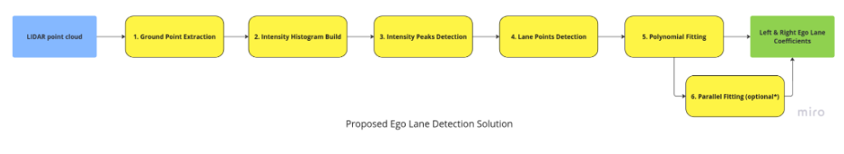

# LIDAR-based Ego Lane Detection

**Author**: Huynh Thai Hoa

## Proposed Solution

As of my knowledge, **Ego Lane Detection from LIDAR point cloud** is still an open research topic, in which the proposed methods can be categorized into 2 directions:
- **Image-processing-based**: these methods rely on heuristics/conventional image processing algorithms such as denoising, edge detection, lane fitting, etc., which are sensitive with various environment conditions.
- **Deep-learning-based**: this is the main chosen direction in recent years thanks to the rapid revolution of hardwares, deep learning algorithms, and methods to collect high-quality ground truth data. Theoretically, given "enough" good training data, training strategy, and a sufficient architecture, deep learning models can produce a more robust lane detection prediction than the classical **image-processing-based** approaches.



My proposed solution includes 5 steps (and 1 more additional step to be considered), as illustrated in the above figure:
- **1. Ground Point Extraction**: in this step, I would like to extract the points inside the **ground plane**, which is called as **ground points**, from the entire input pointcloud data, with the assumption is that the lanes should be on the ground.

- **2. Intensity Histogram Build**: given the tip from the README file (the value of `intensity` is important to distinguish between **lane point** and **non-lane point**), as well as other references, **lane points** in the pointcloud usually have a more distinct and prominent intensity distribution, which appear as high peaks, compared to **non-lane points**. Therefore, I build a histogram of `intensity` from **ground points**, with respect to the `y` value bins.

- **3. Intensity Peaks Detection**: from the intensity histogram that was built from the previous step, I find every intensity peak that potentially consist of `intensity` of the lane points as well. Then, the `intensity peaks` with respect to the left and right lane can be obtained using the following 2 assumptions:
  - **3.1.** Dividing the `y` field values into to half with respect to the ego vehicle (`0, 0`) as the center, **the left lane points** should belong to the left half (`y >= 0`), whereas **the right lane points** should belongs to the right half (`y < 0`)

   - **3.2.** The **width** (`y` differences between **left lane** and **right lane**) should be within a specified baseline

- **4. Lane Points Detection**: from the previous step, we obtained the peak `y` value position from the **2 lane peaks**, I start to detect every point that potentially belong to **the left and right lane** using **the sliding window approach**. Specifically, we start from the peak `y` position mentioned above, and iteratively move along the ego vehicle positive `x-axis` direction to detect the remaining points on the lane.

- **5. Polynomial Fitting**: this step involves estimating a **polynomial curve** on `x` and `y` fields of **the detected lane points**, using a **3-degree polynomial** represented as `y = coef[0] * x ** 3 + coef[1] * x ** 2 + coef[2] * x + coef[3]` (according to the assignment's requirement)

- **6. Parallel Fitting (optional)**: this step aims to refine the estimated coefficients using the assumption that 2 lanes usually parallel to each other along the road. I implemented this step but decided to not use it since it may violate with the constraint in step **3.1**.

## Implementation

Since the proposed solution requires many linear algebra calculations (polynomial fitting, maxima location, etc.), I decided to use Python as the implementation language, so that I can experiment, conceptualize and visualize the solution more quickly and efficiently. All the experiments were conducted on the computer system with Ubuntu 22.04.3 LTS OS, 8GB RAM, and Intel Core i5-1135G7 2.40GHz x 8 processor.

### Dependencies

I keep the dependencies as concise and minimal as possible, following the dependencies that was used in the sample code `data_visualize.py`. You can check the dependencies in `requirements.txt`:
```
matplotlib==3.6.2
numpy==1.22.4
open3d==0.16.0
pynput==1.7.6
PyYAML==6.0.1
scikit-learn==1.3.2
scipy==1.10.1
```

> **Note**: open3d is only used in `data_visualize.py` to visualize the output, my lane detection solution (`main.py` & `lane_detector.py`) does not use open3d dependency

With `conda`, you can set it up as follows:

```
conda create --name lane_test python==3.8
conda activate lane_test
pip install -r requirements.txt
```

### Folder Structure

    .
    |             ├─── ....jpg
    ├── images                            # Images 
    
    ├── configs.yml                       # Configuration file
    
    ├── data_visualize.py                 # Customized assignment's data_visualize.py file

    ├── lane_detector.py                  # Define the LaneDetector class - which is the core of the prosed lane detection solution

    ├── main.py                           # Entry file to run the solution and reproduce the outputs
    
    ├── README.md                         # README file
    ├── requirements.txt                  # Dependencies
    .

### Code Structure

I refactored and organized my code into 3 files:
- **lane_detector.py**: define the `LaneDetector` class, which is basically the full implementation of my prosposed solution. 
- **main.py**: entry file to run the proposed solution on input `bin` files and generate corresponding outputs. 
- **data_visualize.py**: I made a minor update in the file `data_visualize.py` from the assignment zip file, so that you can visualize and check my outputs

---

`LaneDetector` class consists of these methods:
  - *read_pointcloud_data(self, input_path)*: get the pointcloud data from the input file named `input_path`
  
  - *extract_ground_points(self)*: Find the ground plane and ground points from the full pointcloud data (this method is an implementation of **Step 1. Ground Point Extraction**)
   
   - *get_index_inrange(self, start, end)*: get index of every ground point that has `y` value in a range from `start` to `end` (`end` is exclusive)
   
   - *build_intensity_histogram(self)*: build an intensity histogram from the ground points, with `y` plays a role of x-axis, whereas `intensity` plays a role of y-axis (this method is an implementation of **Step 2. Intensity Histogram Build**)
   
   - *detect_peaks(self, y_vals, intensity_vals)*: find all intensity peaks and 2 "lane peaks" that correspond to the potential left and right lanes (this method is an implementation of **Step 3. Intensity Peaks Detection**)

   - *plot_peaks(self, y_accum, intensity_accum, y_peaks, intensity_peaks, selected_ys, selected_intensities)*: plot the intensity histogram (`y_accum`, `intensity_accum`), as well as the detected intensity peaks (`y_peaks`, `intensity_peaks`) and the 2 peaksthat potentially belong to the left and right lanes (`selected_ys`, `selected_intensities`). In default, the peak figure is saved in directory `figures/peaks`

   - *detect_lanes(self, lane_start_ys)*: detect the lane point information (specifically, `x` field and `y` field) using sliding window approach, given the `y` value histogram `lane_start_ys` achieved from the `detect_peaks` function (this method is an implementation of **Step 4. Lane Detection**)

   - *fit_polynomial(self, lanes)*: estimate a polynomial fitting coefficients of the detected left and right lanes `lanes` (this method is an implementation of **Step 5. Polynomial Fitting**)
   
   - *plot_lanes(self, coefs, xs)*: plot detected lanes given the estimated polynomial coefficients `coefs`, as well as `x` values of the lane points `xs`. In default, the lane figure is saved in directory `figures/peaks`
  
   - *save_coefficients(self, coefs)*: save estimated polynomial coefficients `coefs` into the text file, following the assignment required format

   - *pipeline(self, input_path)*: run end-to-end lane detection pipeline given the input from `input_path`, this function will also generate the outputs (figures and text files)

   - *apply_parallel_fitting(self, coefs, errs, xs)*: apply parallel constraint fitting to refine the estimated polynomial coefficients (this method was not used in this solution)

---

In `main.py`, I parse the hyperparameter configuration from the config file `configs.yml` to initialize the `LaneDetector` object named `detector`. Function `glob` retrieves all `.bin` file in `pointcloud` directory, then each file is processed end-to-end by `detector.pipeline` method call.


### Output reproduction

- To reproduce the outputs, please run the file `main.py`:

```
python main.py
```

- (Optional) You can also adjust the hyperparameter values in configuration file `configs.yml` and rerun `main.py` to generate outputs with different setup

### Output visualization

To visualize the pointcloud + detected lane output, please run the customized file `data_visualize.py`:

```
python data_visualize.py
```

## Limitations and Future Works
- Even though I have spent some hours to refactor and clean the code, as well as avoiding "hard value" by putting them all into the configuration file, I believe the code can still be optimized & organized to make it more efficiency.
- The solution requires several "fixed" hyperparameter setup, which is a bad practice to apply in real scenarios, which desperately needs a more adaptive, robust solution to deal with different conditions. Also, it may be one of the reason why my output has a difference with the sample output.
- The solution utilizes several "approximation" methods/methods that contains random sampling, with potentially generates different outputs via different runs. To ensure the reproducibility, I set up the seed value (as you can see in line 15, file `lane_detector.py`).
- The step **6. Parallel Fitting** can be investigated more deeply and improved/optimized to properly improve the lane detection result.

## Thank you for your interest!
